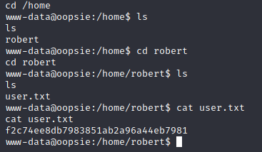

# Oopsie Box

This challenged didn't have much information other than the IP address.
As it turns out it was related to the previous challenge Archetype. In that it used the same admin password. 

For this challenge I used Kali linux tools, and OWASP ZAP quite a bit.

## Recon

I'll start off with nmap

We have ssh open and http

Brings us to a nice web site

In the page source we can see some other folders containing scripts and a potential login portal.

Found a login page by using the above URI

## Compromising the server

The next part was tricky, I tried some injection commands and brute force attacks, but wasn't getting anywhere.

After reading on the forum, it turns out the password was the same from the previous CTF. To be honest I thought the challenges were not linked, but in this case they are...

After using that password I got from the ARCHETYPE CTF with the username admin I was able to get access to the site. 

First thing I noticed was an uploads section which should be a good place to upload some code, like a reverse shell. But it requires 'super admin' rights to the site.

## Payload delivery 
## Exploiting IDOR, an Upload portal and cookie IDs.

Under the accounts section we can see an IDOR referencing the user ID, maybe I can find the super admin's ID.

Also in a request after I logged in, I can see the cookie matches the 'Access ID' in the Admin's account. I'd suggest if we can find the super admin's ID, we could use this as the cookie information.

Trying a few ID numbers led to no info, but I will try and brute force these numbers with the ZAP fuzzer attack.

I'll try ids from 1 to 100 using the numberzz feature in the fuzzer. 

After a few seconds I had a hit, ID 30 had a similar body response size as ID 1. 

Now I have the super admin's cookie id, their Access ID.

I turned on proxy intercept (or break mode) and changed the cookie ID to try and access the upload section.

Now I have access to the Upload portal. Next I'll upload a simple PHP reverse shell and create a netcat listener on my attack box.

Upload successful, I had to intercept the request and update the cookie as per the last step too, otherwise I was getting access denied. I also had dirbuster (DIRB) running in another shell when I was trying to brute force the admin login page. DIRB found the uploads/ URI, but I accidentally closed it before taking a screen grab.

Now to access the uploaded file.

And I have a shell!

## Flag 1

A quick search around the home folders and I found the first flag.

## Privilege Escalation

I did a search for SUID files with find / -perm -4000 2>/dev/null and found one called bugtracker, but I don't have execute rights as my current user.

I'll hunt around the www folder, since the site probably uses a DB, there might be something there.

We are in luck the db.php file contains some user credentials, the user who we found the first flag in.

I'll try this over ssh.

I'm in, and it looks like i can run the bugtracker application as i'm in the appropriate group. I noted that I cannot run sudo as I'm not in the sudo group.

So I'll check out bugtracker to see if we can exploit it. 

A nice little shell app, looks like it retrieves some data from somewhere.

I'll see what the strings command yields from this executable.

The program makes a call to 'cat' using a relative path, so I can exploit this.

I'll create a file called cat that launches a bash session and adjust my path.

Here is the file, permissions updated to executable and path adjusted.

## Flag 2

And here we have it! I am root, below is the flag

